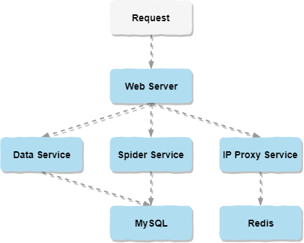
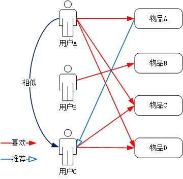
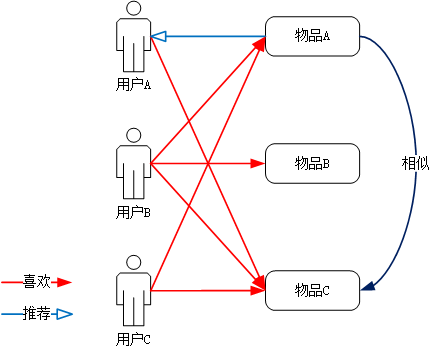
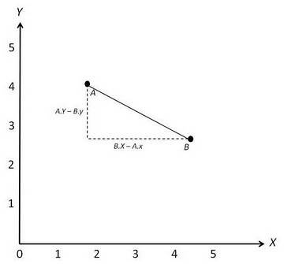
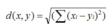
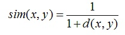
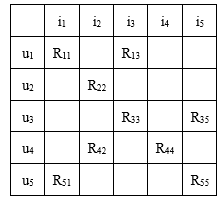
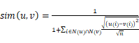
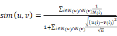
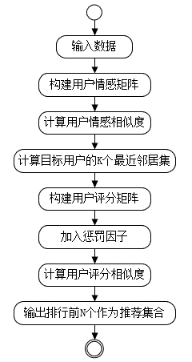

简介：做这个项目的初衷是因为对音乐的热爱和突发的臆想：寻找音乐世界中的有缘人。从2019年的3月开始，从臆想的迸发，到前后台的设计，再到编码实现，到最后的测试部署。这一路上除了自己的努力学习和奋力前行，也感谢指点过我的老师和帮助过我的同学朋友以及网友。通过做这个项目不仅巩固了已有的知识，还学习了很多新知识运用其中。目前小程序端已经实现了类似网易云音乐的音乐播放器，还有特有的音乐互动，以及专属推荐等功能。后台主要的支撑技术有推荐算法、爬虫技术和IP代理。

附：此小程序已经发布正式版，可在微信中搜索“**寻找最佳音缘**”或者扫下图微信小程序码打开，欢迎大家使用及反馈~

寻找最佳音缘_服务端

* [系统架构图](#系统架构图)
* [演示效果图](#演示效果图)
* [开发环境](#开发环境)
* [推荐算法](#推荐算法)
* [爬虫技术](#爬虫技术)
* [IP代理](#IP代理)

## 系统架构图

## 演示效果图

## 开发环境
* 开发语言：Java、Python
* 数据库：MySQL 5.7、Redis 4.0
* 服务器：Tomcat 9.0

## 推荐算法
基于协同过滤算法进行改进，实现了一种基于用户情感相似度的协同过滤算法，引入用户情感相似度以应对用户听歌情感的不可评分化并提高推荐的准确性。

### [协同过滤算法](https://baike.baidu.com/item/协同过滤/)
协同过滤（Collaborative Filtering，简称CF）是一种最经典的推荐算法。

协同过滤算法主要通过分析用户的历史数据，用以构建用户模型并进行推荐。协同过滤算法主要分为以下两类：一类是基于用户的协同过滤算法（User-Based Collaborative Filtering，简称UserCF），另一类是基于物品的协同过滤算法（Item-Based Collaborative Filtering，简称ItemCF）。

（1）基于用户的协同过滤算法

UserCF算法的核心是用户，思想是“人以群分”。算法的基本思路是：首先找到和目标用户喜好相似的邻居用户集体，然后以此为基础计算出目标用户对未操作物品的喜好预测评分，根据评分的高低推荐前N个给目标用户。  
如图3-3所示，形象的表现了基于用户的协同过滤算法的总体思想：假设用户C为目标用户，根据图3-3可知，因为用户A和用户C由相同评分物品C和D，可知用户C的相似用户为用户A；又因为用户A已评分的集合物品A是用户C未操作的，所以将物品A推荐给目标用户C。
  

（2）基于物品的协同过滤算法

ItemCF算法的核心是物品，思想是“物以类聚”。算法的基本思路是：首先计算物品之间的相似度，然后根据目标用户的历史行为，将与之相似度较高的物品推荐给目标用户。
如图3-4所示，假设用户A为目标用户，根据图3-4可知，因为物品A和物品C同时被用户B和用户C评分，因此物品C的相似邻居为物品A，又因为目标用户A对物品C已评分，所以将物品A推荐给目标用户A。

### 改进的协同过滤算法

传统的协同过滤推荐算法的思想如下。

（1）使用评分计算其他用户和目标用户的相似度；

（2）找出K个和目标用户相似度最高的邻居用户； 

（3）向目标用户推荐邻居喜欢的物品且目标用户没有操作过的物品。

音乐推荐应用场景中，传统的协同过滤算法有如下几点可以改进。

**（1）用户相似度计算的改进**

传统的协同过滤算法在音乐推荐时实现的思想是，构建一个稀疏的用户-歌曲评分矩阵，根据用户对歌曲的评分，计算出用户的相似度。

但对于音乐方面，用户偏好并不是评分就能笼统表达的，仅利用评分的填充会使得填充后的矩阵出现一定偏差，比如两个用户都收藏过《海阔天空》，这并不能说明他们相似度高，因为听歌时还带有用户的情感，可能用户A感觉斗志昂扬，但用户B感觉情绪低落。如果两个用户的感受相似，则可以更好地说明他们的相似性。

因此，针对上述这个问题，考虑到用户听歌时带有情感性，引入情感相似度，以此来提高系统推荐的准确性，改善用户的体验。基于音乐互动模块对用户情感进行分析，将用户情感数值化，基于情感相似度结合协同过滤推荐算法找出与目标用户最相似的邻居用户。

**此改进方法的具体思想如下。**

首先，通过音乐互动模块将用户互动所得的用户情感相似性数值化后，使用欧几里德距离公式计算用户间的情感相似度。欧几里德度量公式是一种简单易懂的用以计算相似度的方法。它是将用户共同参与的互动作为坐标轴，然后，将参与互动的用户放置在坐标系中，并计算两个用户之间的直线距离。在二维坐标中，两用户的欧几里德距离如图3-5所示。

由此可推导到i维坐标中，两用户之间的欧几里德距离如公式（4.1）所示。

上述欧几里德距离公式计算出来的是一个大于或等于0的数，使用公式（4.2）将其规范到(0, 1]之间，以便更直观地反映用户之间的相似度。

可以将数据库中的数据构建出一个用户-互动分值矩阵，如图3-6所示，通过矩阵的构建和计算可以找到u1的情感相似用户u3和u5。

用户u和用户v的情感相似度计算公式如（4.3）所示。

其中，N(u)表示用户u已经参与过的互动集合，N(v)表示用户v已经参与过的互动集合。u(i)表示用户u对互动i的偏好，v(i)表示用户v对互动i的偏好。n表示用户u和用户v共同参与过的互动数。

**（2）加权系数惩罚热门物品**

在音乐场景下经常产生热门歌曲，如果热门歌曲出现次数较多，就会影响实际相似度的计算结果，从而导致推荐的歌曲都是热门歌曲，无法满足用户的实际需求。为了减小这种影响，可以考虑加入一个加权系数用以惩罚热门歌曲的影响[16]，即惩罚因子。因此本文对相似度的计算公式加以改进，将歌曲出现次数的倒数作为惩罚因子。歌曲出现的次数越多，即改歌曲越热门，同时，该歌曲对用户喜好相似度的贡献则越少。带有惩罚因子的公式可减弱热门歌曲造成的影响，改进后的公式如（4.4）所示。

其中，N(i)表示歌曲i出现的次数，可以看出，该公式加入歌曲出现次数的倒数计算用户u和用户v的共同爱好列表中的相似度，从而惩罚了热门歌曲的影响。

改进后的算法的具体流程，如图3-7所示。

改进后的算法的具体步骤如下。

（1）用户情感分析信息、用户评分信息。

（2）在音乐互动分析的用户情感信息上，进行情感数值化构建用户情感矩阵，计算用户情感相似度。

（3）根据用户情感相似度找出目标用户的K个最近邻居集，并按递减顺序将这些结果值排序。

（4）根据用户听歌的历史行为，构建用户评分矩阵，并加入惩罚因子，计算用户评分相似度。

（5）将最终评分值由高到低排序，并将排序结果推荐给目标用户。

（6）输出目标用户的推荐用户和推荐歌曲集合。

## 爬虫技术

## IP代理

<a href="https://github.com/Kevin-free/yinyuan_weapp" rel="nofollow">寻找最佳音缘_微信小程序端</a>
